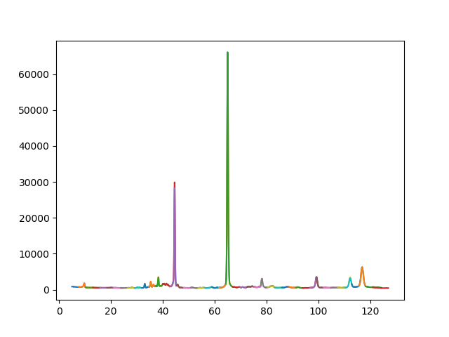
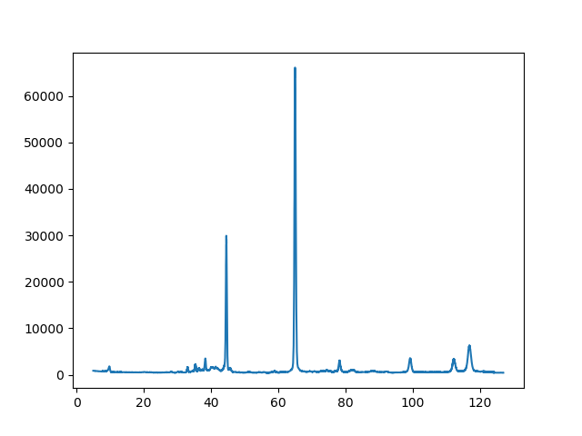

# [POWDER](https://neutrons.ornl.gov/powder) (HB-2A) data reduction

* `load_and_plot.py` will load the data and plot per anode and then all the data combined but not rebinned
* `reduce_old.py` reproduces the data reduction as done by [Graffiti](http://neutron.ornl.gov/spice/User_Downloads.html) (run with `./reduce_old.py datafile output_directory`)
* `read_metadata.py` is an example of loading in all the metadata from a file
* `reduce.py` is the new data reduction in just python, rebinning the data
* `reduce2.py` doesn't use the vcorr file, instead loads the vanadium scan. Also the errors should be correct.
* `reduce_to_mantid.py` is the data reduction outputing to mantid workspaces
* `create_vcorr.py` creates the old style vcorr file from vanadium data

## Example:

### Load and plot

`./load_and_plot.py /HFIR/HB2A/IPTS-21073/exp666/Datafiles/HB2A_exp0666_scan0012.dat`

### Create vcorr file

`./create_vcorr.py /HFIR/HB2A/IPTS-2005/exp644/Datafiles/HB2A_exp0644_scan0018.dat`

`./create_vcorr.py /HFIR/HB2A/IPTS-2005/exp644/Datafiles/HB2A_exp0644_scan0019.dat`
